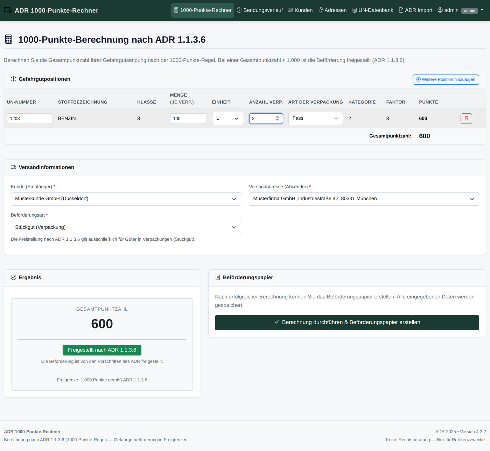

# ADR 1000-Punkte-Rechner

Webanwendung für **Gefahrguttransporte in Verpackungen**: berechnet die
Punktzahl nach **ADR 1.1.3.6** (der *1000-Punkte-Regel*), stellt fest, ob die
Beförderung freigestellt ist, und erzeugt das **Beförderungspapier** nach
ADR 5.4.1 als PDF.

Gedacht für kleine und mittlere Betriebe, die gelegentlich Gefahrgut versenden
und dafür kein ERP-Modul und keine Cloud-Datenbank brauchen: eine Instanz im
eigenen Netz (oder hinter einem Reverse-Proxy), Oberfläche vollständig deutsch,
keine externen Dienste.

> **English:** Dangerous goods transport calculation under ADR 1.1.3.6 (the
> 1000-point rule) for packaged goods, including exemption checking and
> generation of the ADR 5.4.1 transport document as PDF. German-language web
> application, deployed as a single Docker container.

<p align="center">
  
  
  
  
  
  
</p>



---

## Inhalt

- [Was das Programm leistet](#was-das-programm-leistet)
- [Versionshistorie — was sich verbessert hat](#versionshistorie--was-sich-verbessert-hat)
- [Schnellstart](#schnellstart)
- [Erste Anmeldung](#erste-anmeldung)
- [Die Seiten der Anwendung](#die-seiten-der-anwendung)
- [ADR 1.1.3.6 — die 1000-Punkte-Regel](#adr-1136--die-1000-punkte-regel)
- [Betrieb und Administration](#betrieb-und-administration)
- [Datenbasis und Lizenz der Daten](#datenbasis-und-lizenz-der-daten)
- [Sicherheit und Datenschutz](#sicherheit-und-datenschutz)
- [Dokumentation](#dokumentation)
- [Entwicklung](#entwicklung)
- [Lizenz und Haftung](#lizenz-und-haftung)

---

## Was das Programm leistet

| Bereich | Leistung |
|---|---|
| **1000-Punkte-Rechner** | Gefahrgutpositionen erfassen, Punktzahl live berechnen, alle vier Voraussetzungen der Freistellung prüfen, blockierende Gründe im Klartext ausweisen |
| **Beförderungspapier** | ADR-konformes PDF nach 5.4.1.1 mit Positionen (UN-Nr., Benennung, Klasse, VG, Stückzahl, Menge, Tunnelcode), Absender, Empfänger, Erklärung und Unterschriftzeilen |
| **UN-Datenbank** | 3.374 Varianten zu 2.347 UN-Nummern aus der amtlichen BAM-Datenbank, filter- und editierbar |
| **Datenpflege** | Import der amtlichen BAM-Datei, Verifikation gegen das ADR-PDF inkl. Prüfsummen von 1.1.3.6 und 5.4.1.1 |
| **Stammdaten** | Kunden und Versandadressen, Excel-Import und -Vorlage, Datenauskunft nach Art. 15/20 DSGVO |
| **Benutzer und Rollen** | Administrator und Benutzer, erzwungener Startpasswort-Wechsel, Kontosperre nach Fehlversuchen, Mailversand von Anfangspasswörtern |
| **Nachvollziehbarkeit** | Audit-Log über Änderungen an Stammdaten, Sendungen, Benutzern und Importen |
| **Betrieb** | ein Container, SQLite-Datei, Healthcheck, Betrieb ohne Internetzugang möglich |

**Bewusste Entscheidungen:** Die Regelengine ist als eigenständiges Modul
(`adr_rules.py`) ohne Flask-Abhängigkeit gebaut und deshalb direkt testbar.
Die Freistellung entscheidet sich **ausschließlich** über die
Beförderungskategorie aus der amtlichen Datenbank — es gibt keine
klassenbasierten Pauschalausschlüsse und keine geschätzten Werte. Widersprüchliche
oder fehlende Angaben führen zum Fail-Safe: **nicht** freigestellt.

---

## Versionshistorie — was sich verbessert hat

Jede Version hat einen konkreten Anlass. Die vollständige Begründung,
Einzelmaßnahmen und Testzahlen stehen in [CHANGELOG.md](CHANGELOG.md).

| Version | Anlass | Kern der Verbesserung |
|---|---|---|
| **4.2.2** | Erststart mit **leerem Datenverzeichnis** brach ab: zwei Worker initialisierten die Datenbank gleichzeitig, einer verlor das Rennen um die SQLite-Sperre (`database is locked`, Exit 3) | Anwendung wird mit `--preload` geladen — `init_db()` läuft einmal im Master. Betraf jede frisch aufgesetzte Instanz, auch Test- und Hosting-Umgebungen. Dazu eine **fertige `render.yaml` für eine kostenlose Testinstanz** |
| **4.2.1** | Oberfläche verwies auf eine Passwortdatei, die es seit 4.1 nicht mehr gibt | Hinweis auf der Seite *Passwort ändern* korrigiert — kein Verhalten geändert |
| **4.2** | Zugangsdaten lagen in der Container-Konfiguration | **Mailserver wird in der Anwendung gepflegt** (`Einstellungen`), `ADR_SMTP_*`/`ADR_MAIL_*` entfallen; Postfachwechsel ohne neuen Container |
| **4.1** | Startpasswort musste vorab verteilt werden | **Erstzugang `admin`/`admin`** mit erzwungenem Wechsel, Anfangspasswort optional per E-Mail, Konten **deaktivieren oder endgültig löschen** |
| **4.0** | Auslieferung an einen Betrieb mit mehreren Standorten | **Benutzerverwaltung** mit Rollen, Passwortrichtlinie, Kontosperre, Audit-Log, DSGVO-Lücken geschlossen |
| **3.0** | Fehlerhafte Punktzahlen durch geschätzte Kategorien | **Amtliche BAM-Daten** statt PDF-Parsing, Variantenschlüssel (UN-Nummer, VG), ADR-PDF nur noch Verifikation |
| **2.0** | Freistellung allein nach Punktzahl war rechtlich falsch | Vollständige Prüfung der **vier kumulativen Voraussetzungen** nach 1.1.3.6, Anmeldepflicht, Audit-Log |

### 4.2.2 — Erststart auf einem leeren Datenbestand

Der erste Start mit einem **leeren Datenverzeichnis** — eine Neuinstallation, eine
frische Testinstanz, ein neuer Server — konnte sofort wieder enden: beide
gunicorn-Worker führten gleichzeitig `init_db()` aus, einer verlor das Rennen um
die Schreibsperre der Datenbank und beendete sich mit `sqlite3.OperationalError:
database is locked`. gunicorn brach daraufhin mit *Worker failed to boot* ab, der
Container stoppte mit Exit-Code 3. Auf einem bereits befüllten Volume fiel das
nie auf, jede frisch aufgesetzte Instanz traf es dagegen zuverlässig.

Seit 4.2.2 lädt gunicorn die Anwendung mit `--preload`: `init_db()` läuft
**einmal** im Master-Prozess, bevor die Worker abgespalten werden — das
Wettrennen entfällt, das Einlesen der 3.374 BAM-Varianten bleibt unverändert.
Wer den Container mit eigenem Startbefehl betreibt, muss `--preload` mitgeben
(oder mit `--workers 1` fahren):

```bash
gunicorn --bind 0.0.0.0:5050 --workers 2 --threads 2 --preload \
  --timeout 120 --access-logfile - --error-logfile - app:app
```

Zusammen mit dieser Version kommt eine **fertige `render.yaml`**: damit lässt
sich der Rechner in wenigen Minuten als kostenlose Testinstanz für Kollegen
veröffentlichen, ohne eine Instanz im eigenen Netz freizugeben (README,
Abschnitt *Testinstanz für Kollegen*).

### 4.2 — Mailversand gehört in die Anwendung

Die Zugangsdaten des Mailservers lagen in Umgebungsvariablen und damit im
Container. Für einen Postfachwechsel brauchte es einen neuen Container, und ein
weitergegebenes Image hätte fremde Zugangsdaten mitgeführt. Seit 4.2 stehen sie
in der Tabelle `settings` dieser Instanz (Seite **Einstellungen**, nur
Administratoren):

* Änderungen wirken **sofort**, ohne Neustart; `ADR_SMTP_*`/`ADR_MAIL_*` gibt es
  nicht mehr.
* Das Postfachpasswort wird **nie angezeigt und nie protokolliert** — die
  Oberfläche erfährt nur, *ob* eines hinterlegt ist.
* *Verbindung testen* meldet sich am Mailserver an, **ohne** eine Nachricht zu
  senden.

### 4.1 — Erstzugang ohne Passwortverteilung

Der erste Administrator entsteht als `admin`/`admin` (`ADR_ADMIN_PASSWORD`
optional) und **muss** bei der ersten Anmeldung ein eigenes Passwort setzen;
bis dahin antwortet jede Seite und jede Schnittstelle mit `403`. Damit braucht
eine Erstinstallation keine vorab verteilten Zugangsdaten und keine
Passwortdatei, die geschützt und wieder gelöscht werden müsste. Zusätzlich:
E-Mail-Adresse je Konto, Anfangspasswort auf Wunsch per E-Mail, und die
Trennung von **Deaktivieren** (umkehrbar, Konto bleibt im Audit-Log zuordenbar)
und **Löschen** (endgültig, für Fehlanlagen und Art. 17 DSGVO).

### 4.0 — Mehrere Standorte, richtlinienkonforme Passwörter

Benutzerverwaltung mit den Rollen *Administrator* und *Benutzer*, eine
Passwortrichtlinie, die auf Länge setzt (BSI TR-02102-1, NIST SP 800-63B) statt
auf Zeichenklassen, Sperre nach zehn Fehlversuchen, ein Audit-Log mit
Aufbewahrungsfrist und die Datenauskunft nach Art. 15/20 DSGVO. Dabei wurden
drei DSGVO-Lücken geschlossen — unter anderem schreibt das Audit-Log bei
Kundenänderungen nur noch die **Feldnamen**, nicht die Werte.

### 3.0 — Amtliche Daten statt geschätzter Kategorien

Tabelle A läuft als 20-spaltige Tabelle über zwei gegenüberliegende Seiten;
beim Auslesen als Text gehen die Spaltengrenzen verloren. Die
Beförderungskategorie wurde deshalb geschätzt — im Zweifel als *Kategorie 3*.
Das ist bei einer Freistellungsentscheidung nicht vertretbar. Seit 3.0 kommen
Kategorie und Punktfaktor aus der amtlichen **Datenbank GEFAHRGUT der BAM**,
die 223 Abweichungen des Altbestands wurden korrigiert (Gegenprobe gegen einen
unabhängigen PDF-Parse: 99,96 % Übereinstimmung). Der natürliche Schlüssel der
UN-Daten ist **(UN-Nummer, Variante)** — 578 der 2.347 UN-Nummern sind
mehrvariantig, und ein Update allein über die UN-Nummer hätte die
Verpackungsgruppen gegenseitig überschrieben.

---

## Schnellstart

### Docker

```bash
docker run -d \
  --name adr-rechner \
  --restart unless-stopped \
  -p 127.0.0.1:5050:5050 \
  -v adr_data:/app/data \
  -v adr_exports:/app/exports \
  -e SECRET_KEY="$(openssl rand -hex 32)" \
  -e TZ=Europe/Berlin \
  kissberg/adr-rechner:latest
```

Danach **http://localhost:5050** öffnen. Beim ersten Start legt die Anwendung
die Datenbank an und lädt die UN-Stammdaten aus der mitgelieferten BAM-Datei
(Protokoll: `[seed] 3374 Varianten aus BAM-Datenbank GEFAHRGUT geladen.`).

| Pfad im Container | Inhalt | Hinweis |
|---|---|---|
| `/app/data` | SQLite-Datenbank (Kunden, Sendungen, Benutzer, Einstellungen) | **als Volume mounten**, sonst ist der Bestand beim nächsten Container weg |
| `/app/exports` | erzeugte Beförderungspapier-PDFs | ebenfalls als Volume |

### Docker Compose

```yaml
services:
  adr-rechner:
    image: kissberg/adr-rechner:latest
    container_name: adr-rechner
    restart: unless-stopped
    ports:
      - "127.0.0.1:5050:5050"
    volumes:
      - adr_data:/app/data
      - adr_exports:/app/exports
    environment:
      - TZ=Europe/Berlin
      - SECRET_KEY=${SECRET_KEY:?SECRET_KEY muss gesetzt werden}
      - ADR_ADMIN_USER=${ADR_ADMIN_USER:-admin}
      - ADR_ADMIN_PASSWORD=${ADR_ADMIN_PASSWORD:-}
      - PREFER_SECURE_COOKIE=${PREFER_SECURE_COOKIE:-0}
      - ADR_PASSWORD_MIN_LENGTH=${ADR_PASSWORD_MIN_LENGTH:-12}
      - ADR_MAX_LOGIN_ATTEMPTS=${ADR_MAX_LOGIN_ATTEMPTS:-10}
      - ADR_LOGIN_LOCKOUT_MINUTES=${ADR_LOGIN_LOCKOUT_MINUTES:-15}
      - ADR_AUDIT_RETENTION_DAYS=${ADR_AUDIT_RETENTION_DAYS:-3650}
      - ADR_AUDIT_LOG_IP=${ADR_AUDIT_LOG_IP:-1}

volumes:
  adr_data:
  adr_exports:
```

```bash
export SECRET_KEY="$(openssl rand -hex 32)"
docker compose up -d
```

### Ohne Docker

```bash
git clone https://github.com/Kissberg/adr-rechner.git
cd adr-rechner
python3 -m venv .venv && . .venv/bin/activate
pip install -r requirements.txt
python app.py          # hört auf 127.0.0.1:5050
```

Voraussetzungen: **Python 3.11+** und `libfreetype6` (für die PDF-Erzeugung).
Für Zugriff aus dem Netz `ADR_HOST=0.0.0.0` setzen — produktiv nur hinter einem
Reverse-Proxy mit TLS.

---

## Erste Anmeldung

Der Erstzugang lautet **`admin` / `admin`** (oder die Werte aus
`ADR_ADMIN_USER`/`ADR_ADMIN_PASSWORD`). Das ist bewusst fest und öffentlich:
eine Erstinstallation braucht so **keine** vorab verteilten Zugangsdaten.
Tragbar ist das nur, weil der Standard ausschließlich bis zur ersten Anmeldung
gilt:

1. Das Konto entsteht mit dem Vermerk *Passwortwechsel erforderlich*.
2. Die Anmeldung führt **direkt** auf die Seite zum Passwortwechsel.
3. Jede andere Seite — auch jede Schnittstelle — antwortet bis dahin mit `403`.
4. Das neue Passwort wird gegen die Richtlinie geprüft; `admin` selbst wird
   abgelehnt.

> **Deshalb gilt:** Die Instanz darf in dieser Erstphase nicht aus einem Netz
> erreichbar sein, in dem jemand anderes als Erster `admin`/`admin` eingeben
> könnte. Danach gehört sie hinter TLS (`PREFER_SECURE_COOKIE=1`).
> Ein vergessenes Administratorkonto lässt sich mit
> `manage.py bootstrap-admin` auf den Erstzugang zurücksetzen.

---

## Die Seiten der Anwendung

| Seite | Route | Funktion |
|---|---|---|
| 1000-Punkte-Rechner | `/` | UN-Suche mit Variantenauswahl, Mengen und Verpackungen erfassen, Punktzahl und Freistellung live, Vorschau |
| Beförderungspapier | `/befoerderungspapier/<id>` | Sendungsübersicht und PDF-Download |
| Sendungsverlauf | `/sendungen` | alle gespeicherten Sendungen, Suche, erneut öffnen, löschen |
| Kunden | `/kunden` | Empfänger verwalten, Excel-Import, Vorlage, Auskunft nach Art. 15 DSGVO |
| Adressen | `/adressen` | Versandadressen (Absender), Standardadresse |
| UN-Datenbank | `/un-datenbank` | 3.374 Varianten durchsuchen, filtern, bearbeiten (nur Administratoren) |
| Daten & Verifikation | `/adr-import` | BAM-Datei importieren, ADR-PDF verifizieren (nur Administratoren) |
| Benutzer | `/benutzer` | Konten, Rollen, Passwörter, Kontosperren (nur Administratoren) |
| Einstellungen | `/einstellungen` | Mailserver dieser Instanz (nur Administratoren) |

Ein Berechnungsvorgang ist zunächst eine **Vorschau** und legt keine Sendung
an; erst *Berechnung durchführen & Beförderungspapier erstellen* speichert.

---

## ADR 1.1.3.6 — die 1000-Punkte-Regel

**Formel:** ∑(Menge je Verpackung × Anzahl Verpackungen × Faktor) über alle
Gefahrgüter einer Beförderung. Bei ≤ 1000 Punkten ist die Beförderung von einem
Teil der ADR-Vorschriften freigestellt — **sofern auch alle übrigen
Voraussetzungen erfüllt sind**:

| Nr. | Voraussetzung | Rechtsgrundlage |
|---|---|---|
| 1 | Beförderung als **Stückgut** (in Versandstücken). Tank und Schüttgut sind nie freigestellt. | 1.1.3.6.2 |
| 2 | Kein Gut hat die **Beförderungskategorie 0** — diese ist niemals freigestellt. | 1.1.3.6.3 |
| 3 | Je Gut wird die **Höchstmenge je Beförderungseinheit** eingehalten. | 1.1.3.6.3 |
| 4 | Die **Gesamtpunktzahl** überschreitet 1000 nicht. | 1.1.3.6.4 |

| Kategorie | Faktor | Höchstmenge je Beförderungseinheit |
|---|---|---|
| 0 | – | 0 (niemals freigestellt) |
| 1 | 50 | 20 kg / L |
| 2 | 3 | 333 kg / L |
| 3 | 1 | 1000 kg / L |
| 4 | – | unbegrenzt (wird nicht gezählt) |

> **Fußnote a) zu 1.1.3.6.3:** Für die UN-Nummern 0081, 0082, 0084, 0241, 0331,
> 0332, 0482, 1005 und 1017 gilt abweichend Faktor **20** und Höchstmenge
> **50 kg**.

> **Fail-Safe:** Lässt sich eine Voraussetzung nicht zweifelsfrei prüfen
> (unbekannte Kategorie, nicht gewählte Verpackungsgruppe), wird **nicht**
> freigestellt. Eine zu Unrecht erteilte Freistellung ist ein Rechtsverstoß,
> eine zu Unrecht verweigerte nur die (legale) Vollanwendung des ADR.

**Achtung, häufige Fehlannahme:** Die Höchstmenge gilt **je Gut**, die
Punktzahl für die **gesamte Beförderung**. Es gibt **keine** pauschalen
Klassenausschlüsse (Klasse 1, 6.2 oder 7) — die Entscheidung hängt allein an
der Beförderungskategorie aus Tabelle A, Spalte (15).

---

## Betrieb und Administration

### Umgebungsvariablen

| Variable | Pflicht | Standard | Bedeutung |
|---|:---:|---|---|
| `SECRET_KEY` | empfohlen | zufällig | Sitzungsschlüssel. Ohne festen Wert enden nach jedem Neustart alle Anmeldungen. |
| `AUTH_ENABLED` | nein | `1` | `0` schaltet die Anmeldung ab — nur lokale Entwicklung, **nie** produktiv. |
| `ADR_ADMIN_USER` | nein | `admin` | Benutzername des ersten Administrators. |
| `ADR_ADMIN_PASSWORD` | nein | `admin` | Startpasswort des ersten Administrators; der Wechsel ist immer erzwungen. |
| `ADR_PASSWORD_MIN_LENGTH` | nein | `12` | Mindestlänge neuer Passwörter (unter 8 wird nicht akzeptiert). |
| `ADR_MAX_LOGIN_ATTEMPTS` | nein | `10` | Fehlversuche bis zur Kontosperre. |
| `ADR_LOGIN_LOCKOUT_MINUTES` | nein | `15` | Dauer der Sperre. |
| `ADR_AUDIT_RETENTION_DAYS` | nein | `0` (aus) | Aufbewahrungsfrist des Audit-Logs in Tagen — siehe `DSGVO.md`. |
| `ADR_AUDIT_LOG_IP` | nein | `1` | `0` schreibt keine IP-Adressen ins Audit-Log. |
| `ADR_DB_DIR` / `ADR_DB_PATH` | nein | `/app/data` | Datenverzeichnis/-datei — für **mehrere Instanzen** auf einem Server. |
| `PREFER_SECURE_COOKIE` | nein | `0` | `1` setzt `Secure` am Sitzungscookie. **Nur hinter HTTPS** — über http scheitert die Anmeldung sonst reproduzierbar. |
| `MAX_UPLOAD_MB` | nein | `50` | Obergrenze für PDF-/Excel-Uploads. |
| `ADR_HOST` / `ADR_PORT` | nein | `127.0.0.1`/`5050` | Nur für `python app.py`. |
| `ADR_SMTP_*`, `ADR_MAIL_*` | — | — | **entfallen seit 4.2.** Mailserver unter *Einstellungen* pflegen. |

### Rollen

| Funktion | Administrator | Benutzer |
|---|:---:|:---:|
| Berechnen, Beförderungspapiere, Kunden und Adressen pflegen | ✓ | ✓ |
| Kunden/Adressen löschen, Auskunft nach Art. 15 DSGVO | ✓ | — |
| Benutzerverwaltung, Einstellungen, Audit-Log | ✓ | — |
| UN-Datenbank bearbeiten, Datenimport, Verifikation | ✓ | — |
| Sendungen löschen | ✓ | — |

### Kommandozeile (im Container)

```bash
docker exec -it adr-rechner python manage.py list-users
docker exec -it adr-rechner python manage.py create-user mueller --email mueller@firma.de --send-email
docker exec -it adr-rechner python manage.py reset-password mueller
docker exec -it adr-rechner python manage.py unlock mueller
docker exec -it adr-rechner python manage.py bootstrap-admin   # Notfall: Erstzugang setzen
docker exec -it adr-rechner python manage.py delete-user mueller
docker exec -it adr-rechner python manage.py purge-audit --days 3650
docker exec -it adr-rechner python manage.py check
```

### Mehrere Niederlassungen auf einem Server

Die Anwendung hat **keine Mandantentrennung** — jedes angemeldete Konto sieht
alle Kunden. Für getrennte Zuständigkeiten je Standort deshalb je Standort eine
eigene Instanz betreiben: eigener Port, eigenes Volume, **eigenes
`SECRET_KEY`** (nie dasselbe verwenden, sonst gilt eine Sitzung in beiden).

```bash
docker run -d --name adr-muenchen -p 127.0.0.1:5051:5050 \
  -v adr_muenchen_data:/app/data -v adr_muenchen_exports:/app/exports \
  -e SECRET_KEY="$(openssl rand -hex 32)" -e TZ=Europe/Berlin \
  kissberg/adr-rechner:latest
```

### Testinstanz für Kollegen — kostenlos, ohne eigenen Server

Für Tests durch Kollegen muss keine Instanz im eigenen Netz erreichbar gemacht
werden. Der Rechner läuft als einzelner Container auch auf einem kostenlosen
Angebot; die mitgelieferte **`render.yaml`** beschreibt die Konfiguration für
[Render](https://render.com) (Hobby-Tarif, 0 €/Monat, keine Zahlungsdaten
hinterlegt):

1. Auf render.com anmelden → **New → Blueprint** → dieses Repository auswählen.
   Render liest `render.yaml`, baut das Image aus dem Dockerfile und fragt nur
   noch nach einem Namen.
2. Nach wenigen Minuten ist die Instanz unter `https://<name>.onrender.com`
   erreichbar — die Adresse lässt sich weitergeben wie jede andere Webseite.

Was die Blueprint setzt:

| Punkt | Wert | Grund |
|---|---|---|
| Instanztyp | Free (512 MB RAM) | gemessener Bedarf der Anwendung: ca. 80 MB |
| Startbefehl | `gunicorn --bind 0.0.0.0:$PORT … --preload app:app` | der Port kommt vom Hoster; `--preload` ist Pflicht (siehe 4.2.2) |
| Healthcheck | `/healthz` | ohne Anmeldung erreichbar |
| `AUTH_ENABLED` | `0` | **nur** für die Testinstanz: auf einer öffentlichen Adresse soll es keinen Administratorzugang geben |
| `SECRET_KEY` | von Render erzeugt | Sitzungsschlüssel |

**Grenzen der kostenlosen Instanz** (Angaben des Anbieters): nach 15 Minuten
ohne Zugriff schläft sie ein und braucht beim nächsten Aufruf etwa eine Minute;
das Dateisystem ist flüchtig, angelegte Kunden und Sendungen sind nach einem
Neustart weg — die UN-Datenbank baut sich beim Start automatisch neu auf,
rechnen und Beförderungspapier funktionieren also unverändert; 5 GB Datenverkehr
pro Monat. Wer Testdaten behalten will, braucht eine bezahlte Instanz mit
Datenträger oder betreibt die Anwendung im eigenen Netz.

> **Keine echten Daten in eine öffentliche Testinstanz.** Die Datenbank startet
> auf einem leeren Volume; ohne eingebundenes produktives Volume sind dort keine
> Kunden- und Sendungsdaten vorhanden. Soll die Anmeldung mitgetestet werden,
> `AUTH_ENABLED=1` **und** ein eigenes Startpasswort setzen — `admin`/`admin`
> gehört nie auf eine öffentliche Adresse.

### Sicherung und Update

```bash
# Sicherung (vor jedem Update)
docker run --rm -v adr_data:/data:ro -v "$HOME/backup":/backup alpine \
  tar czf /backup/adr_data-$(date +%Y%m%d).tar.gz -C /data .

# Update
docker pull kissberg/adr-rechner:latest
docker kill adr-rechner && docker rm adr-rechner
docker run -d --name adr-rechner --restart unless-stopped \
  -p 127.0.0.1:5050:5050 -v adr_data:/app/data -v adr_exports:/app/exports \
  -e SECRET_KEY="$(cat ~/adr_secret.key)" -e TZ=Europe/Berlin \
  kissberg/adr-rechner:latest
curl -s http://127.0.0.1:5050/healthz
# {"status":"ok","un_numbers":3374,"version":"4.2.2"}
```

Datenbankänderungen laufen beim Start automatisch (`CREATE TABLE IF NOT EXISTS`
und Spaltenergänzungen) — es gibt keinen separaten Migrationsschritt. Entscheidend
ist allein, dass das Volume `/app/data` erhalten bleibt.

---

## Datenbasis und Lizenz der Daten

Die UN-Stammdaten stammen aus der **Datenbank GEFAHRGUT (DGG)** der
Bundesanstalt für Materialforschung und -prüfung (BAM) und stehen unter der
*Datenlizenz Deutschland – Namensnennung – Version 2.0* (`dl-de/by-2-0`). Die
Quellenangabe ist **Lizenzpflicht** und in der Anwendung hinterlegt:

```
Source: Bundesanstalt für Materialforschung und -prüfung (BAM) –
Datenbank GEFAHRGUT – Data licence Germany – attribution – Version 2.0
```

| Kennzahl | Wert |
|---|---|
| UN-Varianten | 3.374 |
| UN-Nummern | 2.347 |
| davon mehrvariantig (mehrere Verpackungsgruppen) | 578 |
| ohne Beförderungskategorie (nicht freistellungsfähig, Fail-Safe) | 55 |
| Abgleich mit ADR-PDF (ADR 2025) | 2.346 von 2.347 = 99,96 % |

> **Zwei Einschränkungen der BAM-Lizenz:** Die BAM untersagt gemäß § 44b Abs. 3
> UrhG die Nutzung der Daten für **Text- und Data-Mining** — die Verwendung als
> Nachschlagetabelle in dieser Anwendung ist zulässig, das Training von Modellen
> benötigt die schriftliche Zustimmung der BAM. Und die BAM übernimmt **keine
> Gewähr** für Richtigkeit und Vollständigkeit.

**Neue ADR-Ausgabe einspielen:** neue BAM-Datei unter *Daten & Verifikation*
importieren, ADR-PDF beider Bände zur Verifikation hochladen (Band 1 enthält
1.1.3.6, Band 2 enthält 5.4.1.1 — fehlt ein Abschnitt, wird das ausdrücklich
gemeldet) und die Prüfsummen dokumentieren. Ein eigener PDF-Parser steht als
`adr_import.py` bereit, schreibt aber seit 3.0 **nicht** mehr in die Datenbank.

---

## Sicherheit und Datenschutz

* **Jede** Route außer Anmeldung, Statik und `/healthz` verlangt eine Anmeldung;
  Schnittstellen antworten mit `401` statt mit einer Umleitung.
* Passwörter werden ausschließlich als **scrypt-Hash** gespeichert, nie im
  Klartext und nie im Protokoll. Die Richtlinie prüft Länge (≥ 12 Zeichen),
  Sperrliste, Benutzernamen und Zeichenvielfalt.
* **Audit-Log** (append-only): Benutzer, Zeit, Aktion, geänderte Feldnamen,
  optional IP. Aufbewahrungsfrist konfigurierbar, damit das Log nicht unbegrenzt
  wächst (Art. 5 Abs. 1 lit. e DSGVO).
* **Rechte der Betroffenen:** Auskunft und Übertragbarkeit als JSON je Kunde
  (`/api/kunden/<id>/export`), Löschung über Kunden-/Sendungslöschung;
  beim Löschen einer Sendung wird das zugehörige PDF mitgelöscht.
* Container läuft als **unprivilegierter Benutzer** (uid 10001), mit
  Upload-Obergrenze und Healthcheck.
* Vollständige Dokumentation: **[DSGVO.md](DSGVO.md)** — Verzeichnis nach
  Art. 30, Rechtsgrundlagen, Löschkonzept, technische und organisatorische
  Maßnahmen.

> **Offener Punkt für eine GoBD-konforme Archivierung** der
> Beförderungspapiere: dafür ist zusätzlich WORM-Speicher oder
> Signatur/Timestamping nötig (siehe [PLAN.md](PLAN.md)).

---

## Dokumentation

* **[Installations- und Bedienungsanleitung (PDF, Version 4.2.2)](docs/ADR-1000-Punkte-Rechner-Installations-und-Bedienungsanleitung-v4.2.2.pdf)**
  — 36 Seiten deutsch: Installation, erste Inbetriebnahme, Benutzerverwaltung,
  E-Mail-Einstellungen, Rechner, Beförderungspapier, Datenschutz, Betrieb.
* [CHANGELOG.md](CHANGELOG.md) — Änderungen je Version mit Begründung
* [DSGVO.md](DSGVO.md) — Datenschutz-Dokumentation
* [PLAN.md](PLAN.md) — geplante Ausbaustufen
* Abschnittstexte des ADR im Wortlaut: in der Anwendung unter *Daten &
  Verifikation* (1.1.3.6 und 5.4.1.1, mit Prüfsumme)

---

## Entwicklung

```
adr-rechner/
├── app.py                  # Flask-Anwendung: Seiten und Schnittstellen
├── adr_rules.py            # Regelengine zu ADR 1.1.3.6 (ohne Flask, testbar)
├── database.py             # SQLite-Schema, Seed aus der BAM-Datei
├── bam_import.py           # Parser der BAM-Datenbank GEFAHRGUT
├── befoerderungspapier.py  # PDF-Erzeugung nach ADR 5.4.1 (ReportLab)
├── adr_import.py           # ADR-PDF-Parser (PyMuPDF) — nur Verifikation
├── auth.py                 # Anmeldung, Rollen, Benutzer, Passwortrichtlinie
├── settings_store.py       # Einstellungen dieser Instanz
├── mailer.py               # Mailversand (Standardbibliothek)
├── audit.py                # Änderungsprotokoll (append-only)
├── manage.py               # Kommandozeile: Benutzer, Sperren, Audit
├── data/bam/               # BAM-Datei (ADR 2025) + Lizenzhinweis
├── docs/                   # Anleitung (PDF), Screenshots
├── static/ templates/      # Bootstrap 5, Vanilla JS, Jinja2
├── tests/                  # 160 Tests (pytest)
├── DSGVO.md  PLAN.md  CHANGELOG.md
├── Dockerfile              # python:3.11-slim + gunicorn, unprivilegiert
└── docker-compose.yml
```

| Schicht | Technologie |
|---|---|
| Backend | Python 3.11, Flask, gunicorn (2 Worker × 2 Threads) |
| Datenbank | SQLite (WAL-Modus) |
| PDF | ReportLab |
| ADR-PDF-Auswertung | PyMuPDF |
| Oberfläche | Bootstrap 5, Vanilla JavaScript (kein Build-Schritt) |
| CI | GitHub Actions, Python 3.11 und 3.12 |

```bash
python3 -m venv /tmp/adrv && /tmp/adrv/bin/pip install -r requirements-dev.txt
/tmp/adrv/bin/python -m pytest tests/ -q
# 160 passed
```

Abhängigkeiten sind exakt gepinnt (`==`), damit Builds reproduzierbar bleiben;
vor einem Release `pip-audit` laufen lassen.

---

## Lizenz und Haftung

**MIT License** — siehe [LICENSE](LICENSE).

> ⚠️ **Haftungsausschluss:** Die enthaltenen ADR-Daten dienen ausschließlich
> Referenzzwecken. Vor rechtsverbindlicher Nutzung sind alle Daten zwingend mit
> den amtlichen ADR-Vorschriften (ECE/TRANS/300) abzugleichen. Die Anwendung
> ersetzt **weder eine Rechtsberatung noch die Prüfung durch einen
> Gefahrgutbeauftragten**. Der Autor übernimmt keinerlei Gewähr.

**Autor:** Yun Zhu — [GitHub: Kissberg](https://github.com/Kissberg)

**Docker Hub:** [`kissberg/adr-rechner`](https://hub.docker.com/r/kissberg/adr-rechner)

```bash
docker pull kissberg/adr-rechner:latest
```
